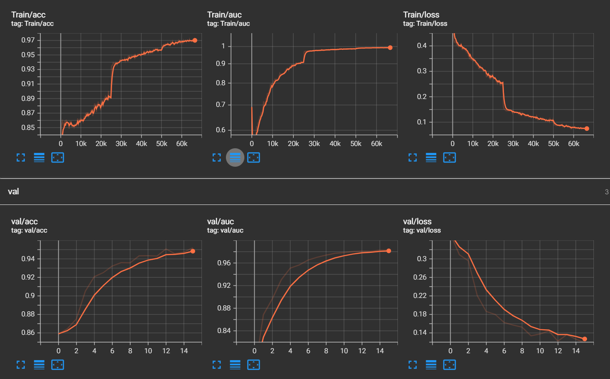

# Deepfake Video Detection System

<p align="center">
  <br/>
  <i>Browser Extension Demo</i>
</p>

## Overview

A comprehensive deepfake detection system with browser extension integration, capable of analyzing and detecting manipulated videos across popular platforms like YouTube.

## Core Components

| Component | Description |
|-----------|-------------|
| Backend API (Flask) | Video analysis and deepfake detection engine |
| Chrome Extension | Integration with popular video platforms |

## Key Features

- Real-time deepfake detection for YouTube videos
- Individual face analysis within videos
- Video classification by confidence levels (Real/Fake/Warning)
- Deepfake probability display for each detected face
- Cross-video face tracking
- User-friendly web interface for analysis results

## Technical Architecture

### Backend Stack

| Technology | Purpose |
|------------|---------|
| Flask | Web API framework |
| PyTorch | Deep learning framework |
| DeepSort | Object tracking algorithm |
| Dlib | Face detection and landmarks |
| OpenCV | Image and video processing |
| Xception | CNN architecture for deepfake classification |
| Ngrok | API exposure |
| yt-dlp | Video platform downloader |

### Chrome Extension Stack

| Technology | Purpose |
|------------|---------|
| Chrome Extension API | Browser integration |
| JavaScript | Frontend logic |
| HTML/CSS | UI components |

## Installation Guide

### Prerequisites

- Python 3.10
- CUDA (recommended)
- Chrome browser

### Setup Steps

1. **Install Dependencies**

```bash
pip install -r requirements.txt
```

2. **Download Model Weights**

- Download [best.pt](https://drive.google.com/file/d/1EIQP6N-LH-3oNf0G9aVv91Nv38edra_z/view?usp=sharing)
- Place in `checkpoint/` directory

3. **Chrome Extension Setup**

- Navigate to `chrome://extensions/`
- Enable Developer mode
- Load unpacked extension from "Deepfake-extension" folder

4. **Configuration**

- Update `ngrok.yaml` with your auth token
- Verify model paths in `src/utils.py`

## Usage Flow

1. Start backend:

```bash
python backend.py
```

2. Detection process:
   - Access video on supported platforms
   - Click "DeepScan" button
   - Wait for backend analysis
   - View detailed results with face detection and probabilities

## Project Structure

```
deepfake-detection/
├── backend.py                 # Main Flask API server
├── src/                      # Core system source code
│   ├── model.py             # Xception model definition
│   ├── utils.py             # Utility functions and video processing
│   ├── config.py            # Application configuration
│   ├── library/             # Support libraries
│   └── downloader.py        # Platform video downloader
│
├── Deepfake-extension/      # Chrome extension source
│   ├── manifest.json        # Extension configuration
│   ├── popup.html          # Extension UI
│   ├── styles.css          # UI styling
│   └── script.js           # Frontend logic
│
├── static/                  # Analysis results storage
│   ├── uploads/            # Temporary video storage
│   ├── results/            # Analysis output
│   └── images/             # Generated visualizations
│
├── templates/              # HTML templates
│   ├── index.html         # Main analysis page
│   └── results.html       # Results display page
│
└── checkpoint/            # Trained model storage
    └── best.pt           # Trained Xception weights
```

## Technical Details

### Detection Thresholds

| Threshold | Value | Classification |
|-----------|-------|----------------|
| Low | < 30% | Real video |
| High | > 70% | Fake video |
| Medium | 30-70% | Warning zone |

### Performance Optimizations

- Efficient frame extraction using stride method
- Face alignment pre-processing
- Face tracking to minimize redundant analysis

## Performance Metrics


